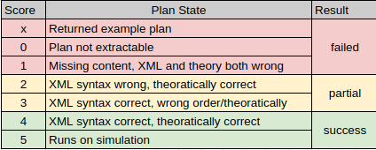

# Experiment 1

To maintain similarity between the tests, prompts of the Fabric has been simplified to focus just on the waypoint navigation and prompts of BTGenBot has been improved with more complex examples (with recovery functions) for oneshot prompts.

To setup Fabric follow instructions in [CollaborativeRoboticsLab/fabric](https://github.com/CollaborativeRoboticsLab/fabric)
To setup Capabilities2 follow instructions in [CollaborativeRoboticsLab/capabilities2](https://github.com/CollaborativeRoboticsLab/capabilities2)

Original BTGenBot is available in [AIRLab-POLIMI/BTGenBot](https://github.com/AIRLab-POLIMI/BTGenBot)
An updated version with ros2 humble support and detailed setup instructions can be found in [KalanaRatnayake/BTGenBot](https://github.com/KalanaRatnayake/BTGenBot)

## Setup

Clone this repo

Create a python virtual environment

```bash 
cd Fabric-vs-BTGenBot-comparison/Experiment_1/
python3 -m venv .venv
source .venv/bin/activate
```

Install Dependencies

```bash
pip install -r requirements.txt
```

## Running evaluations

Activate the venv

```bash
source .venv/bin/activate
```

Following commands will run the code for each of the tasks available in the respective tasks folders and create files in the sub
directories within `Fabric` and `BTGenBot`

- `logs` folder will contain log files for each execution 
- `outputs` folder will contain execution plans in different subdirectories based on the model, prompt type
- `timing_data` contains extracted time information for each run. To generate this data, please see following section called **Extract execution times**
- `runnable` contains plans identified as complete and executable by the evaluation team.

### Pre-requisites

To run these experiments, the user need to complete following pre-requisites.

- Huggingface API Key - create a account with HuggingFace and follow instructions [Official](https://huggingface.co/docs/hub/en/security-tokens), [3rd Party](https://www.nightfall.ai/ai-security-101/hugging-face-api-key), [Video](https://www.youtube.com/watch?v=aCYSpo-8ijI)
- OpenAI api key - Create an account with OpenAI and follow instructions [Settings](https://platform.openai.com/api-keys), [Video](https://www.youtube.com/watch?v=SzPE_AE0eEo), [3rd-Party](https://medium.com/@lorenzozar/how-to-get-your-own-openai-api-key-f4d44e60c327)
- Request access to LLama's gated Models [here](https://huggingface.co/meta-llama/Llama-2-7b-chat-hf)
- A computer with a GPU of at least 16GB. The llamachat and codellama models downloads and runs locally.


### BTGenBot Experiments

To run the experiments move into the BTGenBot folder

```bash
cd BTGenBot
```

To run the BT generation with llamachat, run the following command. It will prompt for the Huggingface api key, enter the key once prompted. And press enter.

There will also be a prompt asking `Add token as git credential? (Y/n)` which is hidden due to we writing the log into a file. Press `n` in empty terminal and press enter to proceed. This will timeout as well. This can be seen by opening the `BTGenBot/logs/llamachat-rawlog.log`

```bash
python3 inference-llamachat.py >> logs/llamachat-rawlog.log
```

To run the BT generation with codellama follow the above mentioned steps again

```bash
python3 inference-codellama.py >> logs/codellama-rawlog.log
```

To run the BT generation with openai models, export your openai api key as shown bellow. replace `<your_openai_key_here>` eith the actual api key. Select the required file or run each consecutively.

```bash
export OPENAI_API_KEY=<your_openai_key_here>
python3 inference-openai-4o.py >> logs/openai-4o-rawlog.log
python3 inference-openai-4.1.py >> logs/openai-4.1-rawlog.log
python3 inference-openai-5.py >> logs/openai-5-rawlog.log
```

### Fabric

To run the experiments move in to the Fabric folder

```bash
cd Fabric
```

To run the generation with llamachat, run the following command. It will prompt for the Huggingface api key, enter the key once prompted. And press enter.

There will also be a prompt asking `Add token as git credential? (Y/n)` which is hidden due to we writing the log into a file. Press `n` in empty terminal and press enter to proceed. This will timeout as well. This can be seen by opening the `BTGenBot/logs/llamachat-rawlog.log`

```bash
python3 inference-llamachat.py >> logs/llamachat-rawlog.log
```

To run the generation with codellama follow the above mentioned steps again

```bash
python3 inference-codellama.py >> logs/codellama-rawlog.log
```

To run the generation with openai, export your openai api key as shown bellow. replace `<your_openai_key_here>` eith the actual api key. Select the required file or run each consecutively.

```bash
export OPENAI_API_KEY=<your_openai_key_here>
python3 inference-openai-4o.py >> logs/openai-4o-rawlog.log
python3 inference-openai-4.1.py >> logs/openai-4.1-rawlog.log
python3 inference-openai-5.py >> logs/openai-5-rawlog.log
```

## Evaluation

### Extract execution times

Run the following files to extract timing data as text and csv files.

For Fabric

```bash
cd Fabric
python3 extract-execution-time.py
```

For BTGenBot

```bash
cd BTGenBot
python3 extract-execution-time.py
```

### Evaluate Execution Plans

Execution Plan Evaluations were done by 3 human evaluators who follows the below scoring approach and attempted to score related to next sections ideal results.



- Score X is for instances where the result was corrupted. These only occured in oneshot prompting and contained the example plan used in oneshot prompt

- Score 0 is when the xml file was not generated. In this scenarios, a incomplete plan can be seen in the log file. But mainly it lacks `<root></root>` tags in BTGenBot and `<Plan></Plan>` in Fabric which is used to extract the plan from the text.

- Score 1 is when either xml file exist but the content is missing or both xml syntax wrong and theoretical approach in the plan is wrong.

- Score 2 is when xml syntax (xml element names, xml attribute names) are wrong but the theoretical approach (logic, xml attribute values) are  correct.

- Score 3 is when xml syntax (xml element names, xml attribute names) are correct but the theoretical approach (logic, xml attribute values) are  wrong.

- Score 4 is when xml syntax (xml element names, xml attribute names) are correct and the theoretical approach (logic, xml attribute values) are  correct.

Once the scoring was done by each individual independently, the results were condensed into `failed`, `partial` and `success` as shown in the above image. Finally the results of the 3 evaluations was aggregated to reduce the human error.

### Ideal results

Following are the ideal execution plans for the asks are available in `BTGenBot/tasks/` and `Fabric/tasks` folders

#### Task 1 (Generative 1)

Fabric

```xml
<Plan>
  <Control type="sequential" name="move_to_target">
    <Runner interface="capabilities2_runner_nav2/WaypointRunner" provider="capabilities2_runner_nav2/WaypointRunner" x="2.0" y="-0.5" />
  </Control>
</Plan>
```

BTGenBot

```xml
<root main_tree_to_execute = "MainTree" >
    <BehaviorTree ID="MainTree">
        <Sequence>
            <MoveTo location="StationA"/>
        </Sequence>
    </BehaviorTree>
</root>
```

#### Task 2 (Generative 2)

Fabric

```xml
<Plan>
  <Control type="sequential" name="navigate_waypoints">
    <Runner interface="capabilities2_runner_nav2/WaypointRunner" provider="capabilities2_runner_nav2/WaypointRunner" x="2.0" y="-0.5" />
    <Runner interface="capabilities2_runner_nav2/WaypointRunner" provider="capabilities2_runner_nav2/WaypointRunner" x="0.0" y="2.0" />
    <Runner interface="capabilities2_runner_nav2/WaypointRunner" provider="capabilities2_runner_nav2/WaypointRunner" x="-2.0" y="0.0" />
    <Runner interface="capabilities2_runner_nav2/WaypointRunner" provider="capabilities2_runner_nav2/WaypointRunner" x="0.0" y="-2.0" />
  </Control>
</Plan>
```

BTGenBot

```xml
<root main_tree_to_execute = "MainTree" >
    <BehaviorTree ID="MainTree">
        <Sequence>
            <MoveTo location="StationA"/>
            <MoveTo location="StationB"/>
            <MoveTo location="StationC"/>
            <MoveTo location="StationD"/>
        </Sequence>
    </BehaviorTree>
</root>
```

#### Task 3 (Generative 3)

Fabric

```xml
<Plan>
  <Control type="sequential" name="main_execution_plan">
    <Runner interface="capabilities2_runner_nav2/WaypointRunner" provider="capabilities2_runner_nav2/WaypointRunner" x="2.0" y="-0.5" />
    <Runner interface="capabilities2_runner_nav2/WaypointRunner" provider="capabilities2_runner_nav2/WaypointRunner" x="1.0" y="3.0" />
    <Control type="recovery" name="recover_if_1_0_3_0_unreachable">
      <Runner interface="capabilities2_runner_nav2/WaypointRunner" provider="capabilities2_runner_nav2/WaypointRunner" x="0.0" y="2.0" />
    </Control>
    <Runner interface="capabilities2_runner_nav2/WaypointRunner" provider="capabilities2_runner_nav2/WaypointRunner" x="-2.0" y="0.0" />
    <Runner interface="capabilities2_runner_nav2/WaypointRunner" provider="capabilities2_runner_nav2/WaypointRunner" x="0.0" y="-2.0" />
  </Control>
</Plan>
```

BTGenBot

```xml
<root main_tree_to_execute="MainTree">
    <BehaviorTree ID="MainTree">
        <Sequence>
            <MoveTo location="StationA"/>
            <Fallback>
                <MoveTo location="StationE"/>
                <MoveTo location="StationB"/>
            </Fallback>
            <MoveTo location="StationC"/>
            <MoveTo location="StationD"/>
        </Sequence>
    </BehaviorTree>
</root>
```

#### Task 4 (Generative 4)

Fabric

```xml
<Plan>
  <Control type="sequential" name="main_execution_plan">
    <Runner interface="capabilities2_runner_nav2/WaypointRunner" provider="capabilities2_runner_nav2/WaypointRunner" x="2.0" y="-0.5" />
    <Runner interface="capabilities2_runner_nav2/WaypointRunner" provider="capabilities2_runner_nav2/WaypointRunner" x="1.0" y="3.0" />
    <Control type="recovery" name="recovery_for_1_0_3_0">
      <Runner interface="capabilities2_runner_nav2/WaypointRunner" provider="capabilities2_runner_nav2/WaypointRunner" x="0.0" y="2.0" />
    </Control>
    <Runner interface="capabilities2_runner_nav2/WaypointRunner" provider="capabilities2_runner_nav2/WaypointRunner" x="-3.0" y="-1.0" />
    <Control type="recovery" name="recovery_for_-3_0_-1_0">
      <Runner interface="capabilities2_runner_nav2/WaypointRunner" provider="capabilities2_runner_nav2/WaypointRunner" x="-2.0" y="0.0" />
    </Control>
    <Runner interface="capabilities2_runner_nav2/WaypointRunner" provider="capabilities2_runner_nav2/WaypointRunner" x="0.0" y="-2.0" />
  </Control>
</Plan>
```

BTGenBot

```xml
<root main_tree_to_execute="MainTree">
    <BehaviorTree ID="MainTree">
        <Sequence>
            <MoveTo location="StationA"/>
            <Fallback>
                <MoveTo location="StationE"/>
                <MoveTo location="StationB"/>
            </Fallback>
            <Fallback>
                <MoveTo location="StationF"/>
                <MoveTo location="StationC"/>
            </Fallback>
            <MoveTo location="StationD"/>
        </Sequence>
    </BehaviorTree>
</root>
```

#### Task 5 (Generative 5)

Fabric

```xml
<Plan>
  <Control type="sequential" name="main_execution_plan">
    <Runner interface="capabilities2_runner_nav2/WaypointRunner" provider="capabilities2_runner_nav2/WaypointRunner" x="2.0" y="-0.5" />
    <Control type="recovery" name="recover_from_point_1_failure">
      <Runner interface="capabilities2_runner_nav2/WaypointRunner" provider="capabilities2_runner_nav2/WaypointRunner" x="0.0" y="2.0" />
    </Control>
    <Runner interface="capabilities2_runner_nav2/WaypointRunner" provider="capabilities2_runner_nav2/WaypointRunner" x="1.0" y="3.0" />
    <Control type="recovery" name="recover_from_point_2_failure">
      <Runner interface="capabilities2_runner_nav2/WaypointRunner" provider="capabilities2_runner_nav2/WaypointRunner" x="0.0" y="2.0" />
    </Control>
    <Runner interface="capabilities2_runner_nav2/WaypointRunner" provider="capabilities2_runner_nav2/WaypointRunner" x="-3.0" y="-1.0" />
    <Control type="recovery" name="recover_from_point_3_failure">
      <Runner interface="capabilities2_runner_nav2/WaypointRunner" provider="capabilities2_runner_nav2/WaypointRunner" x="-2.0" y="0.0" />
    </Control>
    <Runner interface="capabilities2_runner_nav2/WaypointRunner" provider="capabilities2_runner_nav2/WaypointRunner" x="0.0" y="-2.0" />
    <Control type="recovery" name="recover_from_point_4_failure">
      <Runner interface="capabilities2_runner_nav2/WaypointRunner" provider="capabilities2_runner_nav2/WaypointRunner" x="-2.0" y="0.0" />
    </Control>
  </Control>
</Plan>
```

BTGenBot

```xml
<root main_tree_to_execute="MainTree">
    <BehaviorTree ID="MainTree">
        <Sequence>
            <Fallback>
                <MoveTo location="StationA"/>
                <MoveTo location="StationB"/>
            </Fallback>
            <Fallback>
                <MoveTo location="StationE"/>
                <MoveTo location="StationB"/>
            </Fallback>
            <Fallback>
                <MoveTo location="StationF"/>
                <MoveTo location="StationC"/>
            </Fallback>
            <Fallback>
                <MoveTo location="StationD"/>
                <MoveTo location="StationC"/>
            </Fallback>
        </Sequence>
    </BehaviorTree>
</root>
```
