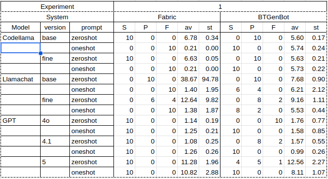
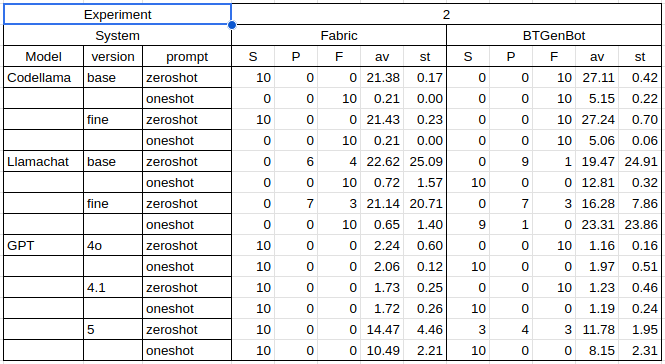
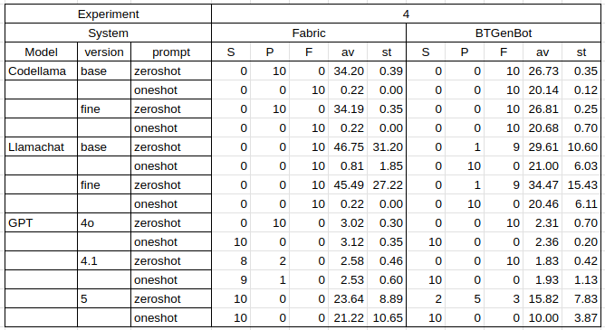
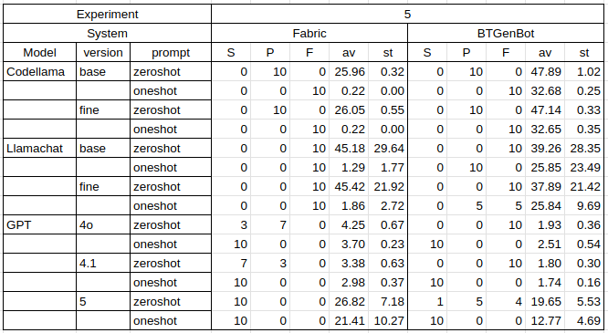

# Fabric vs BTGenBot comparison

This repository contains the experiments designed and executed to evaluate the properties of the Fabric.

## **Experiment 1** 

Experiment 1 was designed to compare the generative properties of the Fabric against BTGenBot. All the source code required to test the system are linked within the `Experiment_1` folder with instructions.

### Results

#### Test 1

#### Test 2

#### Test 3

#### Test 4

#### Test 5

## **Experiment 2**

Experiment 2 was designed to orchestrate complex behaviour planning using Fabric and was developed for the IROS2026 paper. All the source code required to test the system are linked within the `Experiment_2` folder with instructions.

> Please note that the software used in Experiment 2 is a newer version compared to Experiment 1, resulting in minor changes in syntax between the two experiments.